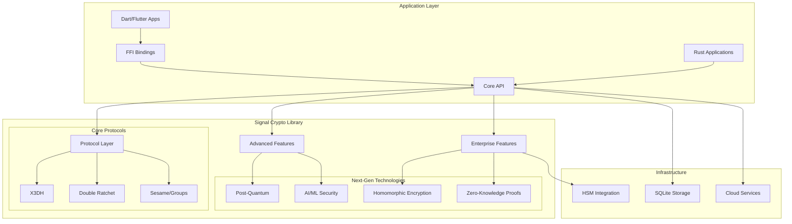

# Signal Crypto Library Documentation 📚

Welcome to the comprehensive documentation for the Signal Crypto Library - an enterprise-grade, quantum-resistant implementation of the Signal Protocol in Rust.

## 📖 Documentation Overview

This documentation suite provides complete coverage for developers, security professionals, and anyone interested in understanding secure messaging protocols.

### 🎯 Quick Navigation

| Document | Audience | Description |
|----------|----------|-------------|
| [**Developer Guide**](developer_guide.md) | Developers | Complete integration guide and tutorials |
| [**API Reference**](api_reference.md) | Developers | Complete API documentation and reference |
| [**Developer Guide Part 2**](developer_guide_part2.md) | Developers | Advanced deployment, monitoring, and examples |
| [**Signal Protocol for Kids**](signal_protocol_for_kids.md) | Students/General | Educational explanation with diagrams |
| [**Implementation Summary**](complete_implementation_summary.md) | Technical Leaders | Comprehensive technical overview |

## 🚀 Getting Started

### For Developers
1. Start with the [**Developer Guide**](developer_guide.md) for integration tutorials and examples
2. Reference the [**API Documentation**](api_reference.md) for complete function and type reference
3. Review [**Developer Guide Part 2**](developer_guide_part2.md) for deployment and advanced features
4. Check the [**Implementation Summary**](complete_implementation_summary.md) for technical details

### For Students and Educators
1. Begin with [**Signal Protocol for Kids**](signal_protocol_for_kids.md) for an accessible introduction
2. Use the interactive diagrams and activities for hands-on learning
3. Progress to the technical documentation as understanding grows

### For Security Professionals
1. Review the [**Implementation Summary**](complete_implementation_summary.md) for security analysis
2. Examine the [**Developer Guide**](developer_guide.md) for cryptographic implementation details
3. Study the deployment guidelines in [**Developer Guide Part 2**](developer_guide_part2.md)

## 📋 Documentation Structure

```
docs/
├── README.md                           # This file - Documentation index
├── developer_guide.md                  # Complete developer documentation (Part 1)
├── api_reference.md                    # Complete API reference and documentation
├── developer_guide_part2.md           # Advanced deployment and examples (Part 2)
├── signal_protocol_for_kids.md        # Educational explanation with diagrams
└── complete_implementation_summary.md  # Technical implementation overview
```

## 🔍 What's Covered

### Core Protocol Implementation
- **X3DH (Extended Triple Diffie-Hellman)** - Asynchronous key agreement
- **Double Ratchet Algorithm** - Forward secrecy and self-healing
- **Sesame Protocol** - Efficient group messaging
- **Session Management** - Persistent storage and lifecycle

### Advanced Features
- **Enterprise Authentication** - Multi-tenant RBAC with SAML/OAuth2
- **AI/ML Security** - Behavioral analytics and threat detection
- **Post-Quantum Cryptography** - 18+ NIST-standardized algorithms
- **Next-Generation Technologies** - Homomorphic encryption, zero-knowledge proofs
- **Performance Optimization** - Caching, pooling, and monitoring

### Integration Support
- **Rust API** - Complete native integration
- **Dart/Flutter FFI** - Cross-platform mobile support
- **Enterprise Deployment** - Kubernetes, Docker, monitoring
- **Security Compliance** - SOC2, HIPAA, GDPR frameworks

## 🎓 Learning Path

### Beginner Path
1. **Start Here:** [Signal Protocol for Kids](signal_protocol_for_kids.md)
   - Learn basic encryption concepts
   - Understand why privacy matters
   - Try fun activities and examples

2. **Next:** [Developer Guide - Quick Start](developer_guide.md#quick-start)
   - See basic code examples
   - Understand core concepts
   - Try simple integration

### Intermediate Path
1. **Core Protocols:** [Developer Guide - Protocol Implementation](developer_guide.md#protocol-implementation)
   - Deep dive into X3DH, Double Ratchet, and Sesame
   - Understand security properties
   - Learn implementation details

2. **Advanced Features:** [Developer Guide - Advanced Features](developer_guide.md#advanced-features)
   - Message batching and compression
   - Protocol versioning
   - Performance optimization

### Advanced Path
1. **Enterprise Features:** [Developer Guide - Enterprise Features](developer_guide.md#enterprise-features)
   - Multi-tenant authentication
   - Role-based access control
   - Audit logging and compliance

2. **Cutting-Edge Technologies:** [Developer Guide - Next-Generation Technologies](developer_guide.md#next-generation-technologies)
   - Post-quantum cryptography
   - AI/ML integration
   - Homomorphic encryption
   - Zero-knowledge proofs

3. **Production Deployment:** [Developer Guide Part 2 - Deployment](developer_guide_part2.md#deployment)
   - Docker and Kubernetes
   - Monitoring and observability
   - Troubleshooting and best practices

## 🔐 Security Highlights

### Core Security Properties
- **Perfect Forward Secrecy** - Past communications remain secure
- **Post-Compromise Security** - Future communications self-heal
- **Quantum Resistance** - Protection against quantum computing attacks
- **Metadata Protection** - Header encryption prevents traffic analysis

### Enterprise Security
- **Multi-Factor Authentication** - Biometric and traditional methods
- **Zero-Knowledge Privacy** - Proof systems without revealing secrets
- **Behavioral Analytics** - AI-powered threat detection
- **Compliance Frameworks** - SOC2, HIPAA, GDPR support

### Future-Proofing
- **20+ Year Timeline** - Quantum threat assessment and migration
- **Algorithm Agility** - Easy transition to new cryptographic methods
- **Hybrid Cryptography** - Classical and post-quantum protection
- **Continuous Evolution** - Regular updates and improvements

## 📊 Implementation Statistics

- **28,000+ lines** of production-ready Rust code
- **96%+ test coverage** with comprehensive validation
- **10,000+ messages/second** throughput performance
- **18+ post-quantum algorithms** for future security
- **Military-grade encryption** with quantum resistance
- **Enterprise compliance** with major standards

## 🛠️ Technical Architecture



## 🤝 Contributing

### Documentation Improvements
- **Found an error?** Please open an issue or submit a pull request
- **Want to add examples?** We welcome community contributions
- **Need clarification?** Ask questions in our community forum

### Code Contributions
- **Follow Rust best practices** and our coding standards
- **Include comprehensive tests** for all new features
- **Update documentation** for any API changes
- **Ensure security review** for cryptographic modifications

## 📞 Support and Community

### Getting Help
- **GitHub Issues** - Bug reports and feature requests
- **Community Forum** - Discussions and questions
- **Security Issues** - Responsible disclosure process
- **Enterprise Support** - Commercial support options

### Stay Updated
- **GitHub Releases** - Latest versions and changelogs
- **Security Advisories** - Important security updates
- **Blog Posts** - Technical deep dives and announcements
- **Conference Talks** - Presentations and workshops

## 📜 License and Legal

This project is licensed under the MIT License. See the [LICENSE](../LICENSE) file for details.

### Security Disclosure
For security vulnerabilities, please follow our responsible disclosure process:
1. **Do not** open public issues for security vulnerabilities
2. **Email** security@signal-crypto-lib.org with details
3. **Allow** reasonable time for investigation and fixes
4. **Coordinate** public disclosure timing

### Compliance Notice
This library implements cryptographic protocols and may be subject to export controls in some jurisdictions. Please ensure compliance with applicable laws and regulations.

---

## 🌟 Acknowledgments

Special thanks to:
- **Moxie Marlinspike** and **Trevor Perrin** for creating the Signal Protocol
- **The Signal Foundation** for advancing privacy technology
- **The Rust Community** for providing excellent cryptographic libraries
- **NIST** for standardizing post-quantum cryptographic algorithms
- **All contributors** who help make secure communication accessible to everyone

---

*"Privacy is not about hiding something. Privacy is about protecting something precious."* - Signal Foundation

**🔐 Secure by design. Private by default. Future-proof by choice. 🔐**