# The Signal Protocol Explained for Middle Schoolers 🔐

## Table of Contents

1. [What is Encryption?](#what-is-encryption)
2. [Why Do We Need Secret Messages?](#why-do-we-need-secret-messages)
3. [The Signal Protocol Story](#the-signal-protocol-story)
4. [How Signal Keeps Your Messages Safe](#how-signal-keeps-your-messages-safe)
5. [The Magic of Key Exchange](#the-magic-of-key-exchange)
6. [The Double Ratchet - Like a Super Lock](#the-double-ratchet---like-a-super-lock)
7. [Group Chats - Sharing Secrets with Friends](#group-chats---sharing-secrets-with-friends)
8. [Quantum Computers - The Future Challenge](#quantum-computers---the-future-challenge)
9. [Real-World Examples](#real-world-examples)
10. [Fun Activities](#fun-activities)

## What is Encryption? 🔒

Imagine you want to send a secret note to your best friend, but you're worried that someone might read it along the way. Encryption is like writing your message in a special secret code that only you and your friend know how to read!

### A Simple Example

**Your original message:** "Meet me at the library after school"

**Encrypted message:** "Nffu nf bu uif mjcsbsz bgufs tdippm"

**The secret:** Each letter is shifted by one in the alphabet (A→B, B→C, etc.)

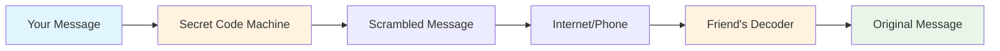

## Why Do We Need Secret Messages? 🕵️

Think about all the private things you share with friends and family:

- **Personal conversations** with your best friend
- **Family photos** you don't want strangers to see
- **School projects** you're working on
- **Birthday surprise plans** for someone special

Without encryption, it's like shouting these secrets across a crowded room where everyone can hear!

### The Problem Without Encryption

```mermaid
graph TB
    subgraph "Without Encryption - Everyone Can See!"
        A[You: 'I have a crush on Alex'] --> B[Internet]
        B --> C[Your Friend]
        B --> D[Hackers 😈]
        B --> E[Companies 👔]
        B --> F[Government 🏛️]
        B --> G[Bullies 😠]
    end
    
    style D fill:#ffebee
    style E fill:#ffebee
    style F fill:#ffebee
    style G fill:#ffebee
```

### The Solution With Encryption

## The Signal Protocol Story 📱

The Signal Protocol is like the ultimate secret code system, invented by really smart people who wanted to make sure your messages stay private. It's used by apps like WhatsApp, Signal, and others to protect billions of messages every day!

### The Heroes Behind Signal

**Moxie Marlinspike** and **Trevor Perrin** are like the superheroes of privacy. They created the Signal Protocol because they believed everyone deserves to have private conversations, just like you do in real life.

### What Makes Signal Special?

Signal Protocol is special because it has **three superpowers**:

1. **🛡️ Perfect Forward Secrecy** - Even if someone steals your secret key today, they can't read your old messages
2. **🔄 Self-Healing** - If your phone gets hacked, future messages automatically become safe again
3. **👥 Group Privacy** - You can have secret group chats with all your friends

## How Signal Keeps Your Messages Safe 🛡️

### The Three-Step Protection Process

```mermaid
graph TD
    subgraph "Step 1: Meeting for the First Time"
        A[Alice's Phone] --> B[Key Exchange Magic]
        C[Bob's Phone] --> B
        B --> D[Shared Secret Created! 🤝]
    end
    
    subgraph "Step 2: Sending Messages"
        D --> E[Alice types: 'Want to hang out?']
        E --> F[Encryption Machine]
        F --> G[Scrambled: 'Kx9#mP2$qR7@']
        G --> H[Internet]
        H --> I[Bob's Phone]
        I --> J[Decryption Machine]
        J --> K[Bob reads: 'Want to hang out?']
    end
    
    subgraph "Step 3: Staying Safe"
        K --> L[Keys Change Automatically]
        L --> M[Next Message Uses New Keys]
        M --> N[Even Safer! 🔒]
    end
    
    style D fill:#e8f5e8
    style F fill:#fff3e0
    style J fill:#fff3e0
    style N fill:#e8f5e8
```

## The Magic of Key Exchange 🗝️

Imagine you and your friend want to create a secret handshake, but you're in different schools. How do you agree on the handshake without anyone else learning it?

### The Diffie-Hellman Magic Trick

This is like a magic trick that mathematicians invented:

```mermaid
graph TB
    subgraph "The Amazing Key Exchange Trick"
        A[Alice picks a secret number: 7] --> B[Alice's Magic Formula]
        C[Bob picks a secret number: 3] --> D[Bob's Magic Formula]
        
        B --> E[Alice sends: 🎨 Blue Paint]
        D --> F[Bob sends: 🎨 Red Paint]
        
        E --> G[Bob mixes: Red + Blue = 💜 Purple]
        F --> H[Alice mixes: Blue + Red = 💜 Purple]
        
        G --> I[Same Purple Color = Shared Secret! 🤝]
        H --> I
    end
    
    style I fill:#e8f5e8
```

**The Amazing Part:** Even if someone sees the blue and red paint being sent, they can't figure out what purple looks like without knowing the secret numbers!

### X3DH: The Super Handshake

X3DH (Extended Triple Diffie-Hellman) is like doing the magic paint trick THREE times to make it extra secure:

```mermaid
graph LR
    subgraph "X3DH: Triple Security"
        A[Identity Keys 🆔] --> D[Mix Together]
        B[Signed Keys ✍️] --> D
        C[One-Time Keys 🎲] --> D
        D --> E[Super Strong Shared Secret! 💪]
    end
    
    style E fill:#e8f5e8
```

## The Double Ratchet - Like a Super Lock 🔐

The Double Ratchet is like having a lock that changes its combination after every single message!

### How It Works

```mermaid
graph TD
    subgraph "Message 1"
        A[Shared Secret] --> B[Generate Key #1]
        B --> C[Encrypt: 'Hi!' → 'Kx9#']
        C --> D[Send Encrypted Message]
        D --> E[Change the Lock! 🔄]
    end
    
    subgraph "Message 2"
        E --> F[Generate Key #2]
        F --> G[Encrypt: 'How are you?' → 'Mq7$pR2@']
        G --> H[Send Encrypted Message]
        H --> I[Change the Lock Again! 🔄]
    end
    
    subgraph "Message 3"
        I --> J[Generate Key #3]
        J --> K[Encrypt: 'Great!' → 'Zx4&nL9%']
        K --> L[Send Encrypted Message]
        L --> M[Keep Changing Forever! ♾️]
    end
    
    style E fill:#fff3e0
    style I fill:#fff3e0
    style M fill:#e8f5e8
```

### Why This is Amazing

**Imagine this scenario:**
- You send 100 messages to your friend
- A hacker steals your phone and gets message #50's key
- **Good news:** They can ONLY read message #50!
- **Even better news:** All your future messages are still completely safe!

### The Two Ratchets Working Together

## Group Chats - Sharing Secrets with Friends 👥

Group chats are trickier because you need to share secrets with multiple people at once!

### The Old Way (Not Secure)

**Problem:** The server can read everyone's messages! 😱

### The Signal Way (Sender Keys)

```mermaid
graph TB
    subgraph "Secure Group Chat with Sender Keys"
        A[Alice creates group key 🗝️] --> B[Shares key with everyone]
        B --> C[Bob gets key]
        B --> D[Charlie gets key]
        B --> E[Diana gets key]
        
        F[Alice: 'Pizza party!'] --> G[Encrypt with group key]
        G --> H[Send to everyone]
        H --> I[Everyone decrypts with same key]
        I --> J[Everyone reads: 'Pizza party!']
    end
    
    style A fill:#e8f5e8
    style J fill:#e8f5e8
```

### Group Key Rotation

Just like individual chats, group keys also change regularly:

## Quantum Computers - The Future Challenge 🚀

### What are Quantum Computers?

Regular computers think in 0s and 1s (like light switches that are either ON or OFF). Quantum computers are like magical switches that can be ON, OFF, and BOTH at the same time! This makes them incredibly powerful.

```mermaid
graph LR
    subgraph "Regular Computer"
        A[Bit 1: 0] --> C[Process]
        B[Bit 2: 1] --> C
        C --> D[Answer: 42]
    end
    
    subgraph "Quantum Computer"
        E[Qubit 1: 0, 1, and both!] --> G[Quantum Process]
        F[Qubit 2: 0, 1, and both!] --> G
        G --> H[All possible answers at once! 🤯]
    end
    
    style G fill:#e1f5fe
    style H fill:#e1f5fe
```

### The Challenge

Current encryption is like a really, really hard math puzzle. Regular computers would take millions of years to solve it. But quantum computers might solve it in just a few hours! 😱

### The Solution: Post-Quantum Cryptography

Scientists are creating new types of encryption that even quantum computers can't break:

```mermaid
graph TB
    subgraph "Current Encryption"
        A[Math Problem: Find two huge prime numbers] --> B[Regular Computer: Million years]
        A --> C[Quantum Computer: Few hours 😱]
    end
    
    subgraph "Post-Quantum Encryption"
        D[New Math Problem: Lattice-based puzzles] --> E[Regular Computer: Still secure]
        D --> F[Quantum Computer: Still can't solve! 😊]
    end
    
    style C fill:#ffebee
    style F fill:#e8f5e8
```

### Signal's Quantum Protection

The Signal Protocol is already preparing for quantum computers by adding extra layers of protection:

```mermaid
graph LR
    subgraph "Hybrid Protection"
        A[Your Message] --> B[Classical Encryption]
        B --> C[Post-Quantum Encryption]
        C --> D[Double Protected Message]
        D --> E[Safe from both regular and quantum attacks! 🛡️]
    end
    
    style E fill:#e8f5e8
```

## Real-World Examples 🌍

### Where Signal Protocol is Used

1. **WhatsApp** 📱 - Over 2 billion people use it daily
2. **Signal App** 📲 - The original app by the creators
3. **Facebook Messenger** 💬 - Secret conversations feature
4. **Google Messages** 📨 - RCS messaging
5. **Skype** 🎥 - Private conversations

### Famous People Who Use Signal

- **Edward Snowden** (Whistleblower who revealed government spying)
- **Elon Musk** (CEO of Tesla and SpaceX)
- **Jack Dorsey** (Former CEO of Twitter)
- **Many journalists and activists** around the world

### Why It Matters

## Fun Activities 🎮

### Activity 1: Caesar Cipher Challenge

Try encoding your own messages using the Caesar cipher (shifting letters):

**Example:** "HELLO" with shift 3 becomes "KHOOR"
- H → K (shift 3)
- E → H (shift 3)
- L → O (shift 3)
- L → O (shift 3)
- O → R (shift 3)

**Your turn:** Encode "SIGNAL IS COOL" with shift 5!

Click for answer

"XNLQFQ NX HTTQ"

### Activity 2: Key Exchange Simulation

**Materials needed:** Colored pencils/crayons, paper

1. Pick a secret color (don't tell anyone!)
2. Mix your secret color with yellow
3. Show your mixed color to a friend
4. Your friend does the same with their secret color
5. Now mix your secret color with your friend's mixed color
6. Your friend mixes their secret color with your mixed color
7. You should both end up with the same final color!

### Activity 3: Message Chain Game

**How to play:**
1. Start with a simple message: "Hi"
2. "Encrypt" it by changing each letter to the next one: "Ij"
3. For the next message, change the rule: shift by 2 letters
4. Keep changing the encryption rule for each message
5. See how the same word looks different each time!

### Activity 4: Group Secret Sharing

**Setup:** Get 4-5 friends together

1. One person creates a "group key" (a simple word like "PIZZA")
2. Everyone writes a message and encrypts it using the group key
3. Pass all encrypted messages around
4. Everyone tries to decrypt all messages using the group key
5. Discuss how this is similar to Signal's group messaging!

## Quiz Time! 🧠

### Question 1
What happens to your old messages if someone steals your phone today?
- A) All messages can be read
- B) Only today's messages can be read
- C) No messages can be read because of forward secrecy ✅

### Question 2
How many times does X3DH perform the key exchange "magic trick"?
- A) Once
- B) Twice  
- C) Three times ✅

### Question 3
What makes quantum computers special?
- A) They're faster
- B) They can be in multiple states at once ✅
- C) They're smaller

### Question 4
Which apps use the Signal Protocol?
- A) Only the Signal app
- B) WhatsApp and Signal
- C) WhatsApp, Signal, Facebook Messenger, and more ✅

## Key Takeaways 🎯

### What You've Learned

1. **Encryption is like a secret code** that keeps your messages private
2. **Signal Protocol is super secure** because it uses multiple layers of protection
3. **Keys change automatically** so even if one gets stolen, others stay safe
4. **Group chats can be secure too** with special group keys
5. **Quantum computers are coming** but Signal is already preparing for them
6. **Millions of people rely on Signal** to stay safe and private

### Why This Matters for You

- **Your conversations stay private** - no one can read your personal messages
- **You're protected from hackers** - even if they try to spy on you
- **Your future is secure** - Signal keeps evolving to stay ahead of threats
- **You can trust your apps** - when they use Signal Protocol, your messages are safe

### The Big Picture

```mermaid
graph TB
    A[Your Private Thoughts] --> B[Signal Protocol Protection]
    B --> C[Safe Communication]
    C --> D[Freedom to Express Yourself]
    D --> E[Better World for Everyone! 🌟]
    
    style A fill:#e1f5fe
    style B fill:#fff3e0
    style C fill:#e8f5e8
    style D fill:#f3e5f5
    style E fill:#fff9c4
```

The Signal Protocol isn't just about technology - it's about protecting your right to have private conversations, just like you do in person. It helps create a world where you can express yourself freely without worrying about who might be listening.

Remember: **Privacy isn't about hiding something bad - it's about protecting something precious: your personal thoughts and conversations!** 💝

---

## Glossary 📚

**Encryption** - Scrambling a message so only the intended recipient can read it

**Key** - The secret information needed to encrypt or decrypt messages

**Protocol** - A set of rules that computers follow to communicate securely

**Forward Secrecy** - Protection that keeps old messages safe even if current keys are stolen

**Quantum Computer** - A super-powerful computer that uses quantum physics

**Post-Quantum Cryptography** - Encryption methods that quantum computers can't break

**X3DH** - The method Signal uses for initial key exchange (Extended Triple Diffie-Hellman)

**Double Ratchet** - The system that changes encryption keys for every message

**Sender Keys** - Special keys used for secure group messaging

---

*"Privacy is not about hiding something. Privacy is about protecting something precious."* - Signal Foundation

🔐 **Stay curious, stay secure!** 🔐